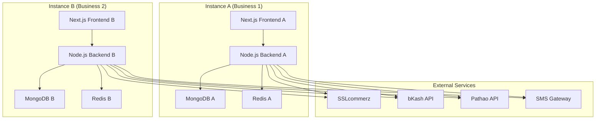
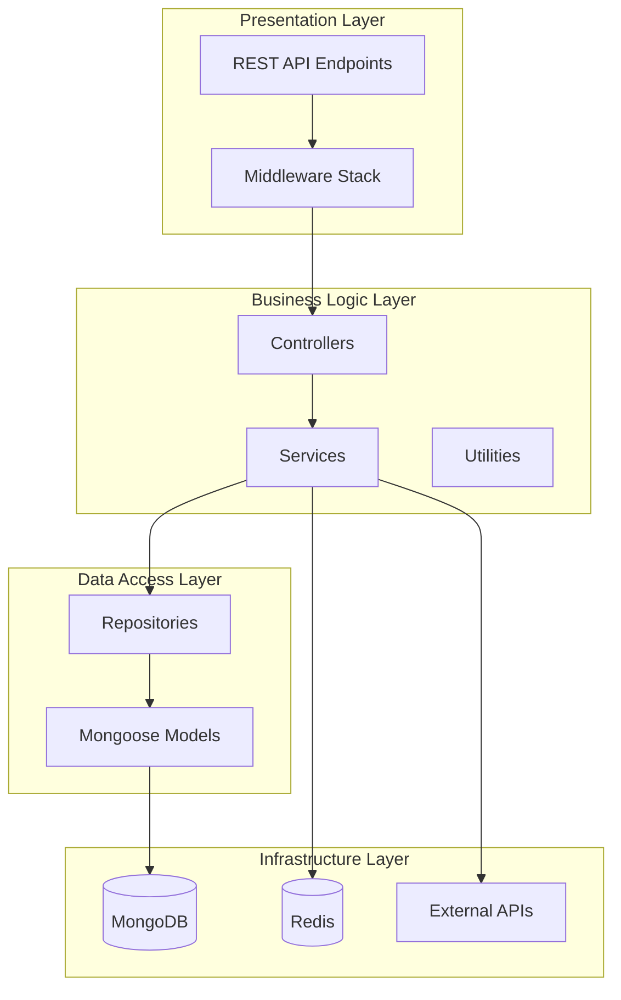
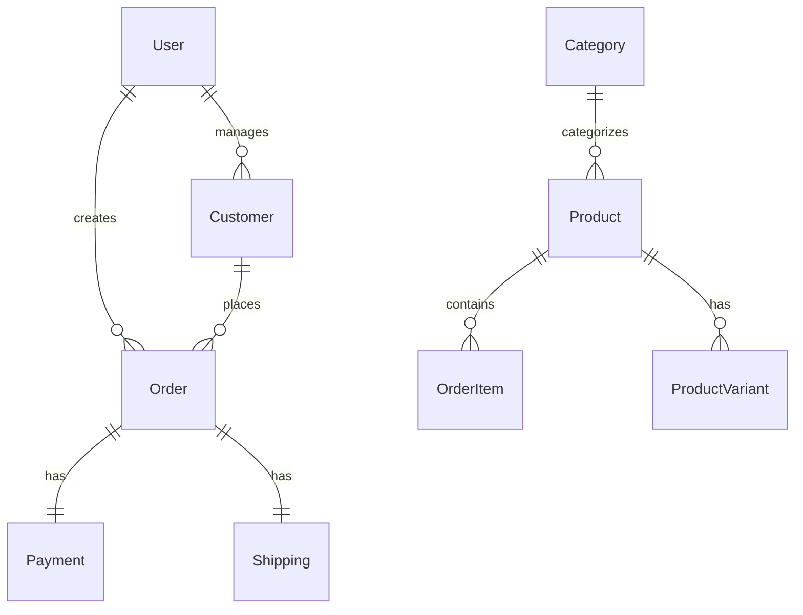
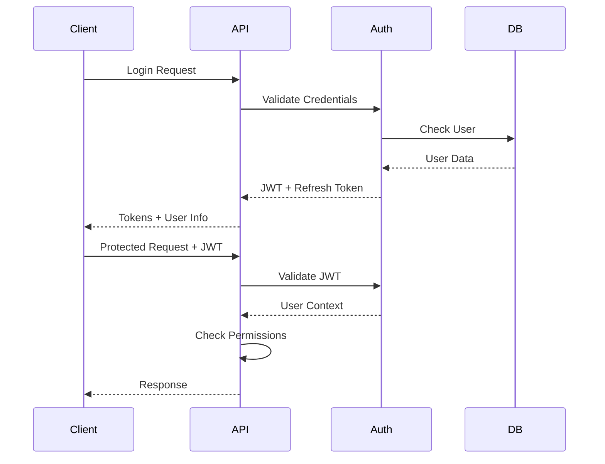
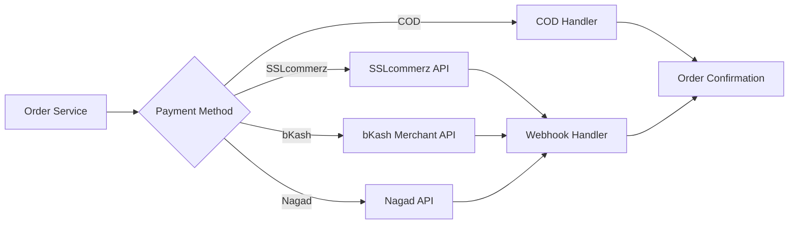

# Design Document

## Overview

The Bangladesh eCommerce Platform is designed as a self-hosted, instance-isolated eCommerce solution built with Node.js, Express, and MongoDB. The architecture follows a modular, API-first approach that enables complete separation between instances while maintaining code reusability. Each deployment operates as an independent business with its own database, configuration, and branding.

The platform emphasizes local optimization for Bangladesh, including payment gateways, shipping providers, localization, and business practices specific to the region. The backend is built with plain JavaScript (ES6+) and designed to integrate seamlessly with Next.js frontends.

## Architecture

### High-Level Architecture



### Backend Architecture Layers



### Directory Structure

```
backend/
├── src/
│   ├── controllers/          # Request handlers
│   │   ├── auth.controller.js
│   │   ├── product.controller.js
│   │   ├── order.controller.js
│   │   ├── customer.controller.js
│   │   └── admin.controller.js
│   ├── services/            # Business logic
│   │   ├── auth.service.js
│   │   ├── product.service.js
│   │   ├── order.service.js
│   │   ├── payment.service.js
│   │   ├── shipping.service.js
│   │   ├── notification.service.js
│   │   └── analytics.service.js
│   ├── repositories/        # Data access layer
│   │   ├── user.repository.js
│   │   ├── product.repository.js
│   │   ├── order.repository.js
│   │   └── customer.repository.js
│   ├── models/             # Mongoose schemas
│   │   ├── User.js
│   │   ├── Product.js
│   │   ├── Order.js
│   │   ├── Customer.js
│   │   └── Category.js
│   ├── middleware/         # Custom middleware
│   │   ├── auth.middleware.js
│   │   ├── validation.middleware.js
│   │   ├── security.middleware.js
│   │   └── logging.middleware.js
│   ├── routes/            # API routes
│   │   ├── auth.routes.js
│   │   ├── products.routes.js
│   │   ├── orders.routes.js
│   │   ├── customers.routes.js
│   │   └── admin.routes.js
│   ├── config/           # Configuration
│   │   ├── database.js
│   │   ├── redis.js
│   │   ├── payment.js
│   │   └── shipping.js
│   ├── utils/           # Utility functions
│   │   ├── validation.js
│   │   ├── encryption.js
│   │   ├── image.utils.js
│   │   ├── pdf.utils.js
│   │   └── seo.utils.js
│   └── jobs/           # Background jobs
│       ├── email.job.js
│       ├── sms.job.js
│       └── inventory.job.js
├── uploads/           # File uploads
├── logs/             # Application logs
├── docker/           # Docker configurations
├── scripts/          # Deployment scripts
└── docs/            # API documentation
```

## Components and Interfaces

### Core Models

#### User Model

```javascript
// User schema for authentication and role management
{
  _id: ObjectId,
  email: String (unique, required),
  password: String (hashed, required),
  role: String (enum: ['admin', 'merchant', 'customer', 'delivery_agent']),
  profile: {
    firstName: String,
    lastName: String,
    phone: String,
    avatar: String
  },
  isActive: Boolean,
  lastLogin: Date,
  createdAt: Date,
  updatedAt: Date
}
```

#### Product Model

```javascript
// Product schema with variants and inventory
{
  _id: ObjectId,
  name: String (required),
  slug: String (unique, SEO-friendly),
  description: String,
  shortDescription: String,
  category: ObjectId (ref: 'Category'),
  tags: [String],
  images: [{
    url: String,
    alt: String,
    isPrimary: Boolean
  }],
  variants: [{
    sku: String (unique),
    attributes: {
      size: String,
      color: String,
      // other variant attributes
    },
    price: Number,
    comparePrice: Number,
    stock: Number,
    lowStockThreshold: Number
  }],
  seo: {
    metaTitle: String,
    metaDescription: String,
    keywords: [String]
  },
  isActive: Boolean,
  createdAt: Date,
  updatedAt: Date
}
```

#### Order Model

```javascript
// Order schema with comprehensive tracking
{
  _id: ObjectId,
  orderNumber: String (unique),
  customer: ObjectId (ref: 'Customer'),
  items: [{
    product: ObjectId (ref: 'Product'),
    variant: ObjectId,
    quantity: Number,
    price: Number,
    total: Number
  }],
  shipping: {
    address: {
      name: String,
      phone: String,
      address: String,
      district: String,
      thana: String,
      postalCode: String
    },
    method: String,
    cost: Number,
    trackingNumber: String,
    courier: String
  },
  payment: {
    method: String (enum: ['cod', 'sslcommerz', 'bkash', 'nagad', 'rocket']),
    status: String (enum: ['pending', 'paid', 'failed', 'refunded']),
    transactionId: String,
    amount: Number
  },
  status: String (enum: ['pending', 'confirmed', 'processing', 'shipped', 'delivered', 'cancelled']),
  subtotal: Number,
  shippingCost: Number,
  tax: Number,
  total: Number,
  notes: String,
  createdAt: Date,
  updatedAt: Date
}
```

### Service Layer Architecture

#### Authentication Service

- JWT token generation and validation
- Password hashing and verification
- Role-based access control
- Session management with refresh tokens

#### Product Service

- CRUD operations with validation
- SEO URL generation
- Image processing and optimization
- Inventory management and alerts

#### Order Service

- Order creation and validation
- Status management and transitions
- Inventory deduction
- Invoice generation

#### Payment Service

- Multiple gateway integration (SSLcommerz, bKash, etc.)
- Transaction processing and validation
- Webhook handling for payment confirmations
- Refund processing

#### Shipping Service

- Courier API integration (Pathao, Paperfly, eCourier)
- Rate calculation
- Label generation
- Tracking updates

#### Notification Service

- SMS integration (Twilio, local providers)
- Email notifications (Nodemailer, SendGrid)
- WhatsApp Business API integration
- Template management

### API Design Patterns

#### RESTful Endpoints Structure

```
/api/v1/auth/*           # Authentication endpoints
/api/v1/products/*       # Product management
/api/v1/orders/*         # Order management
/api/v1/customers/*      # Customer management
/api/v1/admin/*          # Admin operations
/api/v1/analytics/*      # Analytics and reporting
/api/v1/settings/*       # Instance configuration
```

#### Response Format Standardization

```javascript
// Success Response
{
  success: true,
  data: {},
  message: "Operation completed successfully",
  timestamp: "2024-01-01T00:00:00Z"
}

// Error Response
{
  success: false,
  error: {
    code: "VALIDATION_ERROR",
    message: "Invalid input data",
    details: {}
  },
  timestamp: "2024-01-01T00:00:00Z"
}
```

## Data Models

### Database Design Principles

1. **Instance Isolation**: Each deployment uses a separate MongoDB database
2. **Indexing Strategy**: Optimized indexes for frequent queries (products by category, orders by customer)
3. **Data Validation**: Mongoose schema validation with custom validators
4. **Soft Deletes**: Implement soft deletes for critical data (orders, customers)
5. **Audit Trail**: Track changes to important entities

### Key Relationships



### Caching Strategy

#### Redis Cache Structure

```javascript
// Product cache keys
products: category: {
  categoryId;
} // TTL: 1 hour
products: featured; // TTL: 30 minutes
products: search: {
  query;
} // TTL: 15 minutes

// User session cache
session: {
  userId;
} // TTL: 24 hours
cart: {
  sessionId;
} // TTL: 7 days

// Analytics cache
analytics: daily: {
  date;
} // TTL: 24 hours
analytics: popular_products; // TTL: 1 hour
```

## Error Handling

### Error Classification System

1. **Validation Errors** (400): Input validation failures
2. **Authentication Errors** (401): Invalid credentials or tokens
3. **Authorization Errors** (403): Insufficient permissions
4. **Not Found Errors** (404): Resource not found
5. **Business Logic Errors** (422): Business rule violations
6. **Server Errors** (500): Internal server errors

### Error Middleware Stack

```javascript
// Global error handler with logging and sanitization
app.use((error, req, res, next) => {
  logger.error(error);

  if (error.name === "ValidationError") {
    return res.status(400).json({
      success: false,
      error: {
        code: "VALIDATION_ERROR",
        message: "Invalid input data",
        details: sanitizeValidationErrors(error),
      },
    });
  }

  // Handle other error types...
});
```

## Testing Strategy

### Testing Pyramid Approach

1. **Unit Tests** (70%): Test individual functions and methods

   - Service layer business logic
   - Utility functions
   - Model validation

2. **Integration Tests** (20%): Test component interactions

   - API endpoint testing
   - Database operations
   - External service mocking

3. **End-to-End Tests** (10%): Test complete user workflows
   - Order placement flow
   - Payment processing
   - User registration and authentication

### Testing Tools and Framework

- **Jest**: Primary testing framework
- **Supertest**: API endpoint testing
- **MongoDB Memory Server**: In-memory database for testing
- **Sinon**: Mocking external services
- **Istanbul/NYC**: Code coverage reporting

### Test Environment Setup

```javascript
// Test database configuration
const testConfig = {
  mongodb: {
    uri: "mongodb://localhost:27017/ecommerce_test",
    options: {
      useNewUrlParser: true,
      useUnifiedTopology: true,
    },
  },
  redis: {
    host: "localhost",
    port: 6379,
    db: 1, // Separate Redis DB for testing
  },
};
```

## Security Implementation

### Authentication & Authorization Flow



### Security Middleware Stack

1. **Helmet.js**: HTTP security headers
2. **CORS**: Cross-origin resource sharing
3. **Rate Limiting**: Prevent brute force attacks
4. **Input Validation**: Joi schema validation
5. **Data Sanitization**: XSS and NoSQL injection prevention
6. **CSRF Protection**: Cross-site request forgery prevention

### Data Encryption Strategy

- **Passwords**: bcryptjs with salt rounds 12
- **Sensitive Data**: AES-256 encryption for PII
- **API Keys**: Environment variables with rotation capability
- **Database**: MongoDB encryption at rest (production)

## Performance Optimization

### Caching Layers

1. **Application Cache**: Redis for session and frequently accessed data
2. **Database Query Cache**: Mongoose query result caching
3. **Static Asset Cache**: CDN integration for images and files
4. **API Response Cache**: Cache GET endpoints with appropriate TTL

### Database Optimization

- **Indexing Strategy**: Compound indexes for complex queries
- **Query Optimization**: Use projection and lean queries
- **Connection Pooling**: Optimize MongoDB connection pool
- **Aggregation Pipeline**: Efficient data aggregation for analytics

### Image Processing Pipeline

```javascript
// Multi-format image processing
const processProductImage = async (imageBuffer) => {
  const sizes = [
    { name: "thumbnail", width: 150, height: 150 },
    { name: "medium", width: 400, height: 400 },
    { name: "large", width: 800, height: 800 },
  ];

  const formats = ["webp", "jpeg"];

  // Generate multiple sizes and formats
  // Store in organized directory structure
  // Return optimized image URLs
};
```

## Integration Architecture

### Payment Gateway Integration



### Shipping Integration Architecture

- **Unified Shipping Interface**: Abstract shipping service layer
- **Provider-Specific Adapters**: Individual courier service implementations
- **Rate Calculation Engine**: Compare rates across providers
- **Tracking Aggregator**: Unified tracking interface

### Notification System Architecture

```javascript
// Event-driven notification system
const NotificationEvents = {
  ORDER_PLACED: "order.placed",
  ORDER_CONFIRMED: "order.confirmed",
  ORDER_SHIPPED: "order.shipped",
  ORDER_DELIVERED: "order.delivered",
  PAYMENT_RECEIVED: "payment.received",
  LOW_STOCK: "inventory.low_stock",
};

// Multi-channel notification dispatcher
class NotificationService {
  async sendNotification(event, data, channels = ["email", "sms"]) {
    // Process notifications through job queue
    // Support template-based messaging
    // Handle delivery failures and retries
  }
}
```

This design provides a robust, scalable, and maintainable foundation for the Bangladesh eCommerce platform, emphasizing security, performance, and local optimization while maintaining the flexibility needed for independent business deployments.
