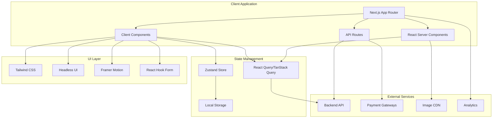

# Design Document

## Overview

The Bangladesh eCommerce Client is a modern Next.js 14+ application that provides a comprehensive frontend interface for the eCommerce platform. Built with TypeScript, Tailwind CSS, and React Server Components, the application delivers a fast, SEO-optimized, and mobile-first experience tailored for the Bangladeshi market.

The architecture follows Next.js App Router patterns with server-side rendering, static generation, and client-side interactivity where needed. The design emphasizes performance, accessibility, and localization while providing distinct interfaces for customers, merchants, and administrators.

## Architecture

### High-Level Architecture



### Application Structure

```
client/
├── src/
│   ├── app/                    # App Router pages and layouts
│   │   ├── (auth)/            # Authentication routes
│   │   ├── (customer)/        # Customer-facing pages
│   │   ├── (merchant)/        # Merchant dashboard
│   │   ├── (admin)/           # Admin panel
│   │   ├── api/               # API routes
│   │   ├── globals.css        # Global styles
│   │   ├── layout.tsx         # Root layout
│   │   └── page.tsx           # Homepage
│   ├── components/            # Reusable components
│   │   ├── ui/               # Base UI components
│   │   ├── forms/            # Form components
│   │   ├── layout/           # Layout components
│   │   ├── product/          # Product-related components
│   │   ├── cart/             # Shopping cart components
│   │   ├── order/            # Order management components
│   │   └── dashboard/        # Dashboard components
│   ├── lib/                  # Utility libraries
│   │   ├── api.ts           # API client configuration
│   │   ├── auth.ts          # Authentication utilities
│   │   ├── utils.ts         # General utilities
│   │   ├── validations.ts   # Form validation schemas
│   │   └── constants.ts     # Application constants
│   ├── hooks/               # Custom React hooks
│   │   ├── useAuth.ts       # Authentication hook
│   │   ├── useCart.ts       # Shopping cart hook
│   │   ├── useLocalStorage.ts # Local storage hook
│   │   └── useDebounce.ts   # Debounce hook
│   ├── store/               # State management
│   │   ├── authStore.ts     # Authentication state
│   │   ├── cartStore.ts     # Shopping cart state
│   │   ├── uiStore.ts       # UI state (modals, notifications)
│   │   └── index.ts         # Store configuration
│   ├── types/               # TypeScript type definitions
│   │   ├── api.ts           # API response types
│   │   ├── auth.ts          # Authentication types
│   │   ├── product.ts       # Product types
│   │   └── order.ts         # Order types
│   └── styles/              # Additional styles
│       ├── components.css   # Component-specific styles
│       └── utilities.css    # Utility classes
├── public/                  # Static assets
│   ├── images/             # Static images
│   ├── icons/              # Icon files
│   └── locales/            # Translation files
├── docs/                   # Documentation
├── tests/                  # Test files
└── config files            # Configuration files
```

## Components and Interfaces

### Core Layout Components

#### Root Layout

```typescript
// app/layout.tsx - Root layout with providers and global configuration
interface RootLayoutProps {
  children: React.ReactNode;
}

export default function RootLayout({ children }: RootLayoutProps) {
  return (
    <html lang="en" suppressHydrationWarning>
      <body className={inter.className}>
        <Providers>
          <Toaster />
          <ProgressBar />
          {children}
        </Providers>
      </body>
    </html>
  );
}
```

#### Customer Layout

```typescript
// app/(customer)/layout.tsx - Customer-facing layout
interface CustomerLayoutProps {
  children: React.ReactNode;
}

export default function CustomerLayout({ children }: CustomerLayoutProps) {
  return (
    <div className="min-h-screen bg-gray-50">
      <Header />
      <NavigationMenu />
      <main className="container mx-auto px-4 py-8">{children}</main>
      <Footer />
      <CartSidebar />
      <MobileBottomNav />
    </div>
  );
}
```

#### Dashboard Layout

```typescript
// app/(merchant)/layout.tsx - Merchant dashboard layout
interface DashboardLayoutProps {
  children: React.ReactNode;
}

export default function DashboardLayout({ children }: DashboardLayoutProps) {
  return (
    <div className="flex h-screen bg-gray-100">
      <Sidebar />
      <div className="flex-1 flex flex-col overflow-hidden">
        <DashboardHeader />
        <main className="flex-1 overflow-x-hidden overflow-y-auto bg-gray-50 p-6">
          {children}
        </main>
      </div>
    </div>
  );
}
```

### Product Components

#### Product Card

```typescript
interface ProductCardProps {
  product: Product;
  variant?: "grid" | "list";
  showQuickAdd?: boolean;
  className?: string;
}

export function ProductCard({
  product,
  variant = "grid",
  showQuickAdd = true,
  className,
}: ProductCardProps) {
  return (
    <div className={cn("group relative", className)}>
      <ProductImage
        src={product.images[0]?.url}
        alt={product.name}
        className="aspect-square w-full object-cover"
      />
      <ProductInfo product={product} />
      {showQuickAdd && <QuickAddButton product={product} />}
      <WishlistButton productId={product.id} />
    </div>
  );
}
```

#### Product Gallery

```typescript
interface ProductGalleryProps {
  images: ProductImage[];
  productName: string;
}

export function ProductGallery({ images, productName }: ProductGalleryProps) {
  const [selectedImage, setSelectedImage] = useState(0);

  return (
    <div className="space-y-4">
      <div className="aspect-square overflow-hidden rounded-lg">
        <Image
          src={images[selectedImage]?.url}
          alt={`${productName} - Image ${selectedImage + 1}`}
          width={600}
          height={600}
          className="h-full w-full object-cover"
          priority
        />
      </div>
      <div className="grid grid-cols-4 gap-2">
        {images.map((image, index) => (
          <button
            key={image.id}
            onClick={() => setSelectedImage(index)}
            className={cn(
              "aspect-square overflow-hidden rounded-md border-2",
              selectedImage === index ? "border-primary" : "border-transparent"
            )}
          >
            <Image
              src={image.url}
              alt={`${productName} thumbnail ${index + 1}`}
              width={150}
              height={150}
              className="h-full w-full object-cover"
            />
          </button>
        ))}
      </div>
    </div>
  );
}
```

### Shopping Cart Components

#### Cart Store (Zustand)

```typescript
interface CartItem {
  id: string;
  productId: string;
  variantId?: string;
  name: string;
  price: number;
  quantity: number;
  image: string;
}

interface CartStore {
  items: CartItem[];
  isOpen: boolean;
  addItem: (item: Omit<CartItem, "id">) => void;
  removeItem: (id: string) => void;
  updateQuantity: (id: string, quantity: number) => void;
  clearCart: () => void;
  toggleCart: () => void;
  getTotalItems: () => number;
  getTotalPrice: () => number;
}

export const useCartStore = create<CartStore>((set, get) => ({
  items: [],
  isOpen: false,
  addItem: (item) => {
    const existingItem = get().items.find(
      (i) => i.productId === item.productId && i.variantId === item.variantId
    );

    if (existingItem) {
      get().updateQuantity(
        existingItem.id,
        existingItem.quantity + item.quantity
      );
    } else {
      set((state) => ({
        items: [...state.items, { ...item, id: nanoid() }],
      }));
    }
  },
  // ... other methods
}));
```

#### Cart Sidebar

```typescript
export function CartSidebar() {
  const { items, isOpen, toggleCart, removeItem, updateQuantity } =
    useCartStore();
  const totalPrice = useCartStore((state) => state.getTotalPrice());

  return (
    <Sheet open={isOpen} onOpenChange={toggleCart}>
      <SheetContent side="right" className="w-full sm:max-w-lg">
        <SheetHeader>
          <SheetTitle>Shopping Cart ({items.length})</SheetTitle>
        </SheetHeader>

        <div className="flex flex-col h-full">
          <div className="flex-1 overflow-y-auto py-4">
            {items.length === 0 ? (
              <EmptyCart />
            ) : (
              <div className="space-y-4">
                {items.map((item) => (
                  <CartItem
                    key={item.id}
                    item={item}
                    onRemove={() => removeItem(item.id)}
                    onUpdateQuantity={(quantity) =>
                      updateQuantity(item.id, quantity)
                    }
                  />
                ))}
              </div>
            )}
          </div>

          {items.length > 0 && (
            <div className="border-t pt-4 space-y-4">
              <div className="flex justify-between text-lg font-semibold">
                <span>Total: ৳{totalPrice.toLocaleString()}</span>
              </div>
              <Button asChild className="w-full">
                <Link href="/checkout">Proceed to Checkout</Link>
              </Button>
            </div>
          )}
        </div>
      </SheetContent>
    </Sheet>
  );
}
```

### Authentication Components

#### Auth Store

```typescript
interface User {
  id: string;
  email: string;
  name: string;
  role: "customer" | "merchant" | "admin" | "delivery_agent";
  avatar?: string;
}

interface AuthStore {
  user: User | null;
  token: string | null;
  isLoading: boolean;
  login: (email: string, password: string) => Promise<void>;
  logout: () => void;
  register: (userData: RegisterData) => Promise<void>;
  refreshToken: () => Promise<void>;
}

export const useAuthStore = create<AuthStore>((set, get) => ({
  user: null,
  token: null,
  isLoading: false,

  login: async (email, password) => {
    set({ isLoading: true });
    try {
      const response = await api.post("/auth/login", { email, password });
      const { user, token, refreshToken } = response.data;

      set({ user, token, isLoading: false });
      localStorage.setItem("token", token);
      localStorage.setItem("refreshToken", refreshToken);
    } catch (error) {
      set({ isLoading: false });
      throw error;
    }
  },

  logout: () => {
    set({ user: null, token: null });
    localStorage.removeItem("token");
    localStorage.removeItem("refreshToken");
    router.push("/login");
  },

  // ... other methods
}));
```

#### Login Form

```typescript
const loginSchema = z.object({
  email: z.string().email("Invalid email address"),
  password: z.string().min(6, "Password must be at least 6 characters"),
});

type LoginFormData = z.infer<typeof loginSchema>;

export function LoginForm() {
  const { login, isLoading } = useAuthStore();
  const router = useRouter();

  const form = useForm<LoginFormData>({
    resolver: zodResolver(loginSchema),
    defaultValues: {
      email: "",
      password: "",
    },
  });

  const onSubmit = async (data: LoginFormData) => {
    try {
      await login(data.email, data.password);
      router.push("/dashboard");
    } catch (error) {
      toast.error("Invalid credentials");
    }
  };

  return (
    <Form {...form}>
      <form onSubmit={form.handleSubmit(onSubmit)} className="space-y-4">
        <FormField
          control={form.control}
          name="email"
          render={({ field }) => (
            <FormItem>
              <FormLabel>Email</FormLabel>
              <FormControl>
                <Input type="email" placeholder="Enter your email" {...field} />
              </FormControl>
              <FormMessage />
            </FormItem>
          )}
        />

        <FormField
          control={form.control}
          name="password"
          render={({ field }) => (
            <FormItem>
              <FormLabel>Password</FormLabel>
              <FormControl>
                <Input
                  type="password"
                  placeholder="Enter your password"
                  {...field}
                />
              </FormControl>
              <FormMessage />
            </FormItem>
          )}
        />

        <Button type="submit" className="w-full" disabled={isLoading}>
          {isLoading ? "Signing in..." : "Sign In"}
        </Button>
      </form>
    </Form>
  );
}
```

## Data Models

### TypeScript Interfaces

#### Product Types

```typescript
interface Product {
  id: string;
  name: string;
  slug: string;
  description: string;
  shortDescription?: string;
  category: Category;
  tags: string[];
  images: ProductImage[];
  variants: ProductVariant[];
  seo: SEOData;
  isActive: boolean;
  createdAt: string;
  updatedAt: string;
}

interface ProductVariant {
  id: string;
  sku: string;
  attributes: Record<string, string>;
  price: number;
  comparePrice?: number;
  stock: number;
  lowStockThreshold: number;
}

interface ProductImage {
  id: string;
  url: string;
  alt: string;
  isPrimary: boolean;
}

interface Category {
  id: string;
  name: string;
  slug: string;
  description?: string;
  image?: string;
  parent?: Category;
  children?: Category[];
}
```

#### Order Types

```typescript
interface Order {
  id: string;
  orderNumber: string;
  customer: Customer;
  items: OrderItem[];
  shipping: ShippingInfo;
  payment: PaymentInfo;
  status: OrderStatus;
  subtotal: number;
  shippingCost: number;
  tax: number;
  total: number;
  notes?: string;
  createdAt: string;
  updatedAt: string;
}

interface OrderItem {
  id: string;
  product: Product;
  variant?: ProductVariant;
  quantity: number;
  price: number;
  total: number;
}

interface ShippingInfo {
  address: Address;
  method: string;
  cost: number;
  trackingNumber?: string;
  courier?: string;
  estimatedDelivery?: string;
}

interface PaymentInfo {
  method: PaymentMethod;
  status: PaymentStatus;
  transactionId?: string;
  amount: number;
}

type OrderStatus =
  | "pending"
  | "confirmed"
  | "processing"
  | "shipped"
  | "delivered"
  | "cancelled";
type PaymentMethod = "cod" | "sslcommerz" | "bkash" | "nagad" | "rocket";
type PaymentStatus = "pending" | "paid" | "failed" | "refunded";
```

#### User Types

```typescript
interface User {
  id: string;
  email: string;
  role: UserRole;
  profile: UserProfile;
  isActive: boolean;
  lastLogin?: string;
  createdAt: string;
  updatedAt: string;
}

interface UserProfile {
  firstName: string;
  lastName: string;
  phone?: string;
  avatar?: string;
  dateOfBirth?: string;
  gender?: "male" | "female" | "other";
}

interface Customer extends User {
  addresses: Address[];
  preferences: CustomerPreferences;
  orderHistory: Order[];
}

interface Address {
  id: string;
  name: string;
  phone: string;
  address: string;
  district: string;
  thana: string;
  postalCode?: string;
  isDefault: boolean;
}

type UserRole = "customer" | "merchant" | "admin" | "delivery_agent";
```

## Error Handling

### Error Boundary Component

```typescript
interface ErrorBoundaryState {
  hasError: boolean;
  error?: Error;
}

export class ErrorBoundary extends Component<
  PropsWithChildren<{}>,
  ErrorBoundaryState
> {
  constructor(props: PropsWithChildren<{}>) {
    super(props);
    this.state = { hasError: false };
  }

  static getDerivedStateFromError(error: Error): ErrorBoundaryState {
    return { hasError: true, error };
  }

  componentDidCatch(error: Error, errorInfo: ErrorInfo) {
    console.error("Error caught by boundary:", error, errorInfo);
    // Send error to monitoring service
  }

  render() {
    if (this.state.hasError) {
      return <ErrorFallback error={this.state.error} />;
    }

    return this.props.children;
  }
}
```

### API Error Handling

```typescript
class ApiError extends Error {
  constructor(
    public status: number,
    public message: string,
    public code?: string
  ) {
    super(message);
    this.name = "ApiError";
  }
}

export const apiClient = axios.create({
  baseURL: process.env.NEXT_PUBLIC_API_URL,
  timeout: 10000,
});

apiClient.interceptors.response.use(
  (response) => response,
  (error) => {
    if (error.response) {
      const { status, data } = error.response;
      throw new ApiError(
        status,
        data.message || "An error occurred",
        data.code
      );
    }
    throw new ApiError(0, "Network error");
  }
);
```

## Testing Strategy

### Testing Architecture

```typescript
// Component Testing with React Testing Library
import { render, screen, fireEvent, waitFor } from "@testing-library/react";
import { ProductCard } from "@/components/product/ProductCard";

describe("ProductCard", () => {
  const mockProduct = {
    id: "1",
    name: "Test Product",
    price: 1000,
    images: [{ url: "/test.jpg", alt: "Test" }],
  };

  it("renders product information correctly", () => {
    render(<ProductCard product={mockProduct} />);

    expect(screen.getByText("Test Product")).toBeInTheDocument();
    expect(screen.getByText("৳1,000")).toBeInTheDocument();
  });

  it("adds product to cart when quick add is clicked", async () => {
    const { addItem } = useCartStore.getState();
    render(<ProductCard product={mockProduct} />);

    fireEvent.click(screen.getByText("Quick Add"));

    await waitFor(() => {
      expect(addItem).toHaveBeenCalledWith({
        productId: "1",
        name: "Test Product",
        price: 1000,
        quantity: 1,
      });
    });
  });
});
```

### E2E Testing with Playwright

```typescript
import { test, expect } from "@playwright/test";

test.describe("Shopping Flow", () => {
  test("complete purchase flow", async ({ page }) => {
    // Navigate to product page
    await page.goto("/products/test-product");

    // Add to cart
    await page.click('[data-testid="add-to-cart"]');

    // Go to checkout
    await page.click('[data-testid="cart-button"]');
    await page.click('[data-testid="checkout-button"]');

    // Fill shipping information
    await page.fill('[name="name"]', "John Doe");
    await page.fill('[name="phone"]', "01712345678");
    await page.fill('[name="address"]', "123 Test Street");

    // Select payment method
    await page.click('[data-testid="payment-cod"]');

    // Complete order
    await page.click('[data-testid="place-order"]');

    // Verify order confirmation
    await expect(page.locator('[data-testid="order-success"]')).toBeVisible();
  });
});
```

## Performance Optimization

### Next.js Optimization Strategies

#### Image Optimization

```typescript
import Image from "next/image";

export function OptimizedProductImage({
  src,
  alt,
  priority = false,
}: {
  src: string;
  alt: string;
  priority?: boolean;
}) {
  return (
    <Image
      src={src}
      alt={alt}
      width={400}
      height={400}
      priority={priority}
      placeholder="blur"
      blurDataURL="data:image/jpeg;base64,/9j/4AAQSkZJRgABAQAAAQABAAD/2wBDAAYEBQYFBAYGBQYHBwYIChAKCgkJChQODwwQFxQYGBcUFhYaHSUfGhsjHBYWICwgIyYnKSopGR8tMC0oMCUoKSj/2wBDAQcHBwoIChMKChMoGhYaKCgoKCgoKCgoKCgoKCgoKCgoKCgoKCgoKCgoKCgoKCgoKCgoKCgoKCgoKCgoKCgoKCj/wAARCAABAAEDASIAAhEBAxEB/8QAFQABAQAAAAAAAAAAAAAAAAAAAAv/xAAUEAEAAAAAAAAAAAAAAAAAAAAA/8QAFQEBAQAAAAAAAAAAAAAAAAAAAAX/xAAUEQEAAAAAAAAAAAAAAAAAAAAA/9oADAMBAAIRAxEAPwCdABmX/9k="
      className="object-cover transition-opacity duration-300"
      sizes="(max-width: 768px) 100vw, (max-width: 1200px) 50vw, 33vw"
    />
  );
}
```

#### Code Splitting and Lazy Loading

```typescript
import dynamic from "next/dynamic";
import { Suspense } from "react";

// Lazy load heavy components
const ProductReviews = dynamic(() => import("./ProductReviews"), {
  loading: () => <ReviewsSkeleton />,
  ssr: false,
});

const AdminAnalytics = dynamic(() => import("./AdminAnalytics"), {
  loading: () => <AnalyticsSkeleton />,
});

export function ProductPage({ product }: { product: Product }) {
  return (
    <div>
      <ProductInfo product={product} />
      <Suspense fallback={<ReviewsSkeleton />}>
        <ProductReviews productId={product.id} />
      </Suspense>
    </div>
  );
}
```

#### Caching Strategy

```typescript
// API Route with caching
export async function GET(request: Request) {
  const { searchParams } = new URL(request.url);
  const category = searchParams.get("category");

  const products = await getProductsByCategory(category);

  return NextResponse.json(products, {
    headers: {
      "Cache-Control": "public, s-maxage=300, stale-while-revalidate=600",
    },
  });
}

// Static generation for product pages
export async function generateStaticParams() {
  const products = await getProducts();

  return products.map((product) => ({
    slug: product.slug,
  }));
}
```

## Localization Implementation

### i18n Configuration

```typescript
// lib/i18n.ts
import { createInstance } from "i18next";
import resourcesToBackend from "i18next-resources-to-backend";
import { initReactI18next } from "react-i18next/initReactI18next";

const initI18next = async (lng: string, ns: string) => {
  const i18nInstance = createInstance();
  await i18nInstance
    .use(initReactI18next)
    .use(
      resourcesToBackend(
        (language: string, namespace: string) =>
          import(`../locales/${language}/${namespace}.json`)
      )
    )
    .init({
      lng,
      fallbackLng: "en",
      supportedLngs: ["en", "bn"],
      defaultNS: ns,
      fallbackNS: "common",
      ns,
    });
  return i18nInstance;
};

export async function useTranslation(lng: string, ns: string = "common") {
  const i18nextInstance = await initI18next(lng, ns);
  return {
    t: i18nextInstance.getFixedT(lng, Array.isArray(ns) ? ns[0] : ns),
    i18n: i18nextInstance,
  };
}
```

### Language Switcher Component

```typescript
export function LanguageSwitcher() {
  const pathname = usePathname();
  const router = useRouter();
  const [currentLang, setCurrentLang] = useState("en");

  const switchLanguage = (lang: string) => {
    setCurrentLang(lang);
    document.documentElement.lang = lang;
    document.documentElement.dir = lang === "bn" ? "ltr" : "ltr";

    // Update URL with language prefix
    const newPath = pathname.replace(/^\/[a-z]{2}/, "") || "/";
    router.push(`/${lang}${newPath}`);
  };

  return (
    <DropdownMenu>
      <DropdownMenuTrigger asChild>
        <Button variant="ghost" size="sm">
          <Globe className="h-4 w-4 mr-2" />
          {currentLang === "bn" ? "বাংলা" : "English"}
        </Button>
      </DropdownMenuTrigger>
      <DropdownMenuContent>
        <DropdownMenuItem onClick={() => switchLanguage("en")}>
          English
        </DropdownMenuItem>
        <DropdownMenuItem onClick={() => switchLanguage("bn")}>
          বাংলা
        </DropdownMenuItem>
      </DropdownMenuContent>
    </DropdownMenu>
  );
}
```

This design provides a comprehensive foundation for building a modern, performant, and user-friendly eCommerce frontend that seamlessly integrates with the existing backend API while delivering an exceptional experience for Bangladeshi users.
